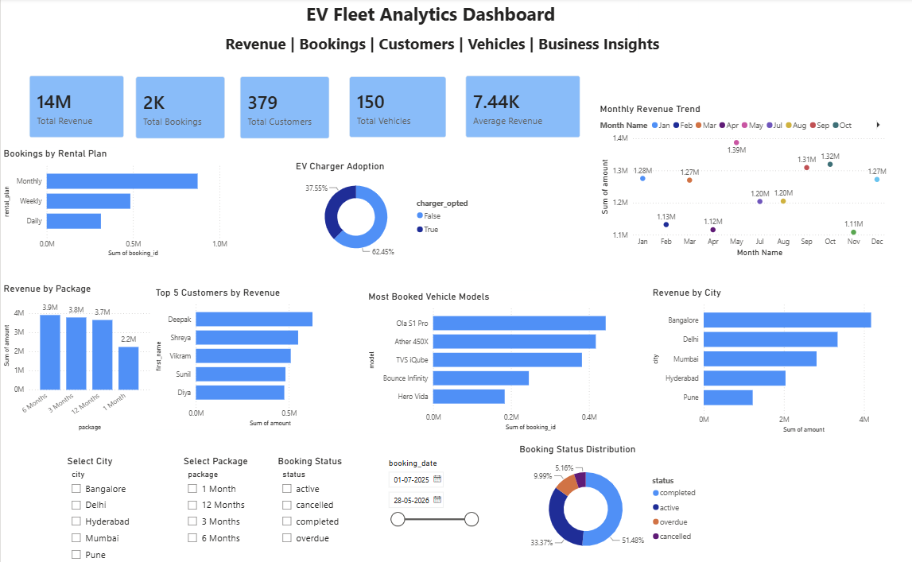

#  EV Fleet Analytics Dashboard

An end-to-end Data Analytics project built using SQL and Power BI to analyze EV fleet operations, customer behavior, booking trends, revenue generation, and business performance.


##  Project Overview

This project demonstrates a complete data analytics workflow:

- Data cleaning and preprocessing
- SQL-based business analysis
- Interactive Power BI dashboard
- Business insights and recommendations

The objective is to help EV fleet businesses make data-driven decisions by identifying revenue trends, customer behavior, vehicle utilization, and operational performance.


## Tech Stack

- SQL (MySQL)
- Power BI
- Microsoft Excel
- Git
- GitHub

## 📊 Dashboard Preview



## Dashboard Visuals


## 📁 Repository Structure

```text
EV-Fleet-Analytics-Dashboard
│
├── Dataset
│   ├── bookings.csv
│   ├── customers.csv
│   ├── hubs.csv
│   ├── payments.csv
│   ├── sales_agents.csv
│   ├── vehicles.csv
│   └── cleaned_master.csv
│
├── Images
│   ├── Dashboard image.png
│   ├── revenue_by_city_query.png
│   ├── monthly_revenue_query.png
│   ├── top_customers_query.png
│   └── database_tables.png
│
├── SQL
│   ├── database_schema.sql
│   └── portfolio_queries.sql
│
├── Documentation
│   └── README.md
│
├── EV_Fleet_Analytics_Dashboard.pbix
└── README.md
```

## ✨ Features

- Interactive KPI Cards
- Revenue Analysis by City
- Monthly Revenue Trend
- Package-wise Revenue Analysis
- Rental Plan Analysis
- EV Charger Adoption Analysis
- Vehicle Model Performance
- Booking Status Distribution
- Dynamic Filters (City, Package, Status, Date)


## 📈 Key Performance Indicators (KPIs)

- Total Revenue
- Total Bookings
- Total Customers
- Total Vehicles
- Average Revenue per Booking

  ## 💡 Business Insights

- Identified the highest revenue-generating cities.
- Compared revenue across subscription packages.
- Analyzed booking trends throughout the year.
- Evaluated EV charger adoption among customers.
- Identified the most popular vehicle models.
- Measured booking completion and cancellation rates.

## 🗄 SQL Analysis

The project includes SQL queries for:

- Revenue by City
- Monthly Revenue Trend
- Revenue by Package
- Booking Status Distribution
- Top Customers by Revenue
- Most Booked Vehicle Models
- ## 🗄 Sample SQL Query
Example query used to identify the highest revenue-generating cities.


## 💼 Business Recommendations

• Increase marketing efforts in high-performing cities.

• Promote long-term subscription packages to improve customer retention.

• Expand the availability of high-demand vehicle models.

• Encourage EV charger adoption through promotional offers.

• Monitor cancelled and overdue bookings to improve operational efficiency.

## 🚀 Future Improvements

- Real-time dashboard using SQL Server
- Machine Learning-based demand prediction
- Customer churn prediction
- Interactive web dashboard deployment

  
## 🛠 Skills Demonstrated

- SQL
- Data Cleaning
- Data Modeling
- Data Visualization
- Power BI
- Dashboard Design
- Business Analytics
- KPI Development
- Git & GitHub

## 👩‍💻 Author

Nikita Chakraborty

Chemical Engineering Undergraduate | MANIT Bhopal

Aspiring Data Analyst

